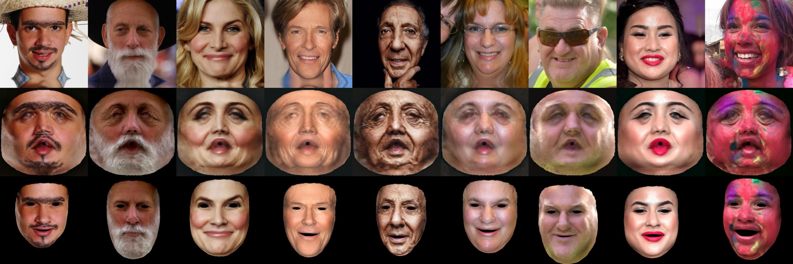

# FreeUV: Ground-Truth-Free Realistic Facial UV Texture Recovery via Cross-Assembly Inference Strategy (CVPR2025)
<a href='https://arxiv.org/abs/2503.17197'></a> &nbsp; 
<a href='https://yangxingchao.github.io/FreeUV-page/'></a> &nbsp; 

The PyTorch code for the following paper:
> [**FreeUV: Ground-Truth-Free Realistic Facial UV Texture Recovery via Cross-Assembly Inference Strategy**](https://yangxingchao.github.io/FreeUV-page/),  
> Xingchao Yang, Takafumi Taketomi, Yuki Endo, Yoshihiro Kanamori,   
> *CVPR 2025*

This project is based on and extends the following projects and uses some of the code and models from them:
> [**Makeup Extraction of 3D Representation via Illumination-Aware Image Decomposition**](https://yangxingchao.github.io/makeup-extract-page),  
> Xingchao Yang, Takafumi Taketomi, Yoshihiro Kanamori,   
> *Computer Graphics Forum (Proc. of Eurographics 2023)*
> 
> [**Stable-Makeup: When Real-World Makeup Transfer Meets Diffusion Model**](https://github.com/Xiaojiu-z/Stable-Makeup),  
> Yuxuan Zhang, Yirui Yuan, Yiren Song, Jiaming Liu   
> *SIGGRAPH 2025*

## Setup

Here we describe the setup required for inferece.

### Requirements

1. Python3.12
2. CUDA 12.2
3. PyTorch 2.4.0

We recommend using Poetry (all settings and dependencies in [pyproject.toml](pyproject.toml))

## Installation
1. Install poetry (see [official docs](https://python-poetry.org/docs/)). We recommend to make a virtualenv and install poetry inside it.

```bash
curl -sSL https://install.python-poetry.org | python3 -
```

2. Install dependencies

```bash
poetry install
```

3. Pretrained resources
   
Following Stable-Makeup, We need [diffusers](https://github.com/huggingface/diffusers/) version of Stable Diffusion v1-5. 
Download [openai/clip-vit-large-patch14](https://huggingface.co/openai/clip-vit-large-patch14) and put it in ```FreeUV\models\image_encoder_l```.


4. Download FreeUV resources
   
Download [FreeUV checkpoints](https://drive.google.com/drive/folders/1GkpZF9Ruzdvr0oX0J7__nkEr0bO5Jotj?usp=drive_link) and put into ```checkpoints``` folder.
```
\checkpoints
```

### Data process environment step
The data process section includes both image preprocessing and postprocessing. 
For details, please refer to the README in [data-process](data-process) folder.

## Inference demo
Recover the complete UV texture from an incomplete input.
(from ```flaw-uv.jpg``` to ```complete_uv.jpg```)

Please ensure that ```step_pre_0_preprocess.py``` and ```step_pre_1_data_prepare.py``` in the ```data-process``` directory are executed before running ```inference.py```.

```
poetry run python inference.py
```


# Citation
If you find our work useful for your research, please consider citing our papers:
```bibtex
@inproceedings{yang2025_freeuv,
        title={FreeUV: Ground-Truth-Free Realistic Facial UV Texture Recovery via Cross-Assembly Inference Strategy}, 
        author={Xingchao Yang and Takafumi Taketomi and Yuki Endo and Yoshihiro Kanamori},
        booktitle={Proceedings of the IEEE/CVF Conference on Computer Vision and Pattern Recognition (CVPR)},
        year={2025},
  }
```

### Acknowledgements
Here are some of the resources we benefit from:
* [makeup-extract](https://github.com/YangXingchao/makeup-extract)
* [Stable-Makeup](https://github.com/Xiaojiu-z/Stable-Makeup)

